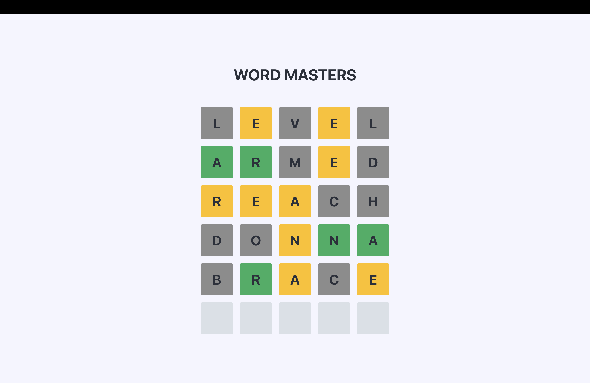

# Wordle Game

This is a Wordle game clone developed with TypeScript and Vite, where players challenge themselves to guess a hidden word within a limited number of attempts. With intuitive gameplay and daily word updates, it offers a fun and engaging experience for all word enthusiasts.

## UI

Here’s a quick demonstration of the project UI:



## Table of Contents

- [Installation](#installation)
- [Usage](#usage)
- [Features](#features)
- [Contributing](#contributing)

## Installation

1. Clone the repository:

   ```sh
   git clone https://github.com/bartlomiejMilosz/wordle-game.git
   ```

2. Navigate to the project directory:

   ```sh
   cd wordle-game
   ```

3. Install the dependencies:

   ```sh
   npm install
   ```

## Usage

To start the development server, run:

```sh
npm run dev
```

To build the project, run:

```sh
npm run build
```

To preview the production build, run:

```sh
npm run preview
```

## Features

- Dynamic word of the day: The word to guess changes every day based on an API, ensuring a fresh challenge for users daily.
- Guess the word within a limited number of attempts.
- Visual feedback for correct, incorrect, and partially correct guesses.
- Loading indicator: A spinner is displayed while waiting for the word or other data, providing a smooth user experience.
- Adaptive UI based on game progress: As players make progress in the game, the interface updates to reflect the state of the game, such as highlighting the guessed letters or showing the next row for input.
- Accessibility features: Designed with accessibility in mind, including keyboard navigation.

## Project Structure

```uml
├── .gitignore
├── biome.json
├── index.html
├── package.json
├── public/
├── src/
│   ├── api/
│   │   ├── api-urls.ts
│   │   ├── fetch-word.ts
│   │   └── validate-word.ts
│   ├── app-state.ts
│   ├── app.ts
│   ├── handlers/
│   │   ├── handle-add-letter.ts
│   │   ├── handle-backspace.ts
│   │   ├── handle-commit.ts
│   │   └── handle-press-key.ts
│   ├── styles/
│   │   ├── reset.css
│   │   └── styles.css
│   ├── types/
│   │   └── custom-dom-elements.d.ts
│   └── utils/
│       ├── dom-utils.ts
│       └── loader.ts
├── tsconfig.json
└── vite.config.ts
```

## Contributing

Contributions are welcome! Please open an issue or submit a pull request for any changes.
